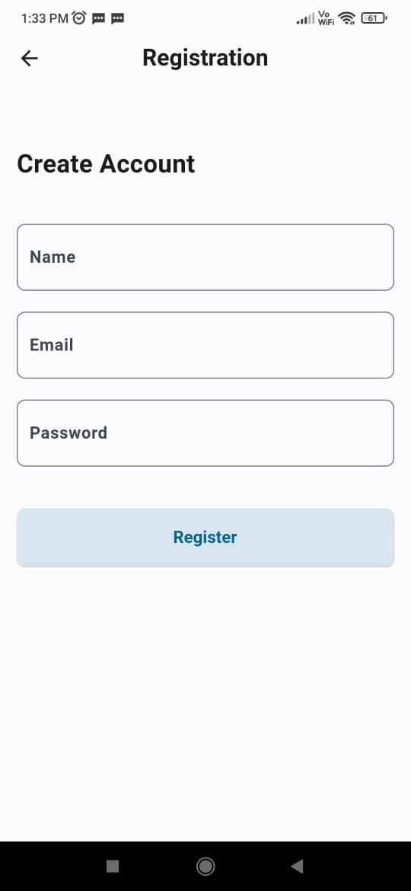

# DormLife - Hostel Management App

DormLife is a hostel management app designed to streamline various aspects of hostel life, including mess menus, feedback, events, complaints, and council details. The app provides authentication and authorization features to ensure only authorized students can access the app's functionalities.

## Installation

To download the latest APK file, click the button below:

## ScreenShots

    

## Features

### Mess Menu

- Display the mess menu for all 7 days of the week.
- Students can easily check the menu to know the meals served on specific days.

### Mess Feedback

- Students can provide feedback on the mess quality and service.
- Feedback can be submitted through the app for convenient communication.

### Mess Feedback Display

- Display a list of feedbacks from students.
- Students and Staff can view the feedbacks through the app.

### Events Display

- Display information about upcoming events happening in the college or hostel.
- Students can stay informed about events and plan their participation.

### Event Creation

- Authorized users can create new events and add relevant details.
- Enables event organizers to promote their events and share important information.

### Complaints Display

- Display a list of registered complaints from students.
- Students can view the status and updates on their complaints through the app.

### Complaint Registration

- Students can register complaints or issues they encounter in the hostel.
- This feature facilitates effective problem reporting and resolution.

### Council Details

- Display details of the hostel council members.
- Students can access information about council members, including their roles and contact details.

## Authentication and Authorization

- The app provides authentication functionality to verify the identity of students.
- Only authorized students can access the app's features and functionalities.
- This ensures data privacy and security within the app.

## Technologies Used

- Frontend: Flutter
- Backend: Laravel
- Database: MYSQL
